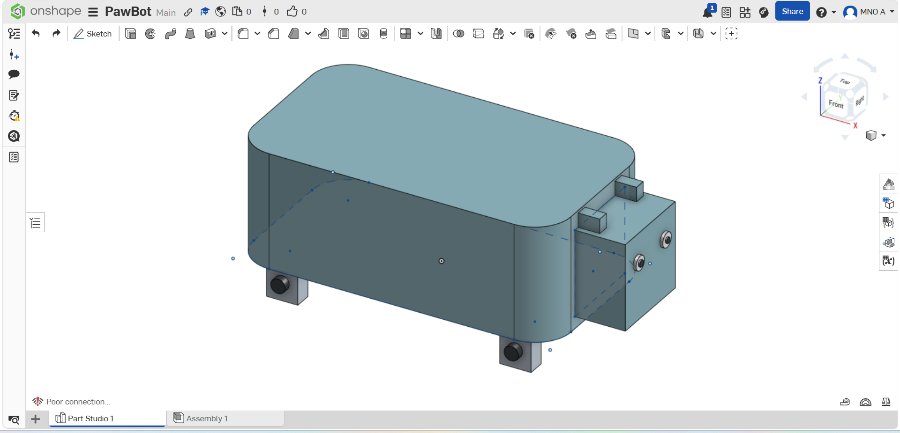
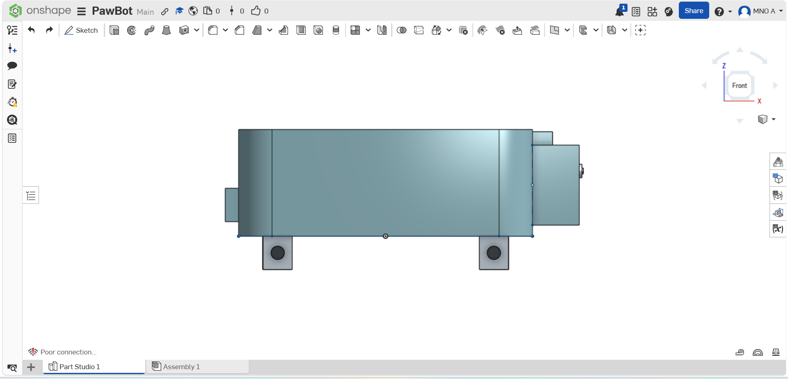

# PawBot-Robot-Dog
3D CAD model of a robot dog created using Onshape .

## About
**PawBot** is a simple 3D robot dog model designed using Onshape as part of a Computer-Aided Design (CAD) assignment.

The project focuses on creating a basic robotic dog by applying fundamental 3D modeling techniques such as sketching, extruding, and assembling simple geometric features. The final model includes the main body, head, legs, joints, ears, tail, and eyes.

## Project Objectives
- Practice basic 3D CAD modeling.
- Learn how to create sketches and convert them into 3D parts.
- Understand how simple components are combined to form a complete model.

## Features
- Robot dog body
- Head
- Four legs
- Leg joints
- Ears
- Tail
- Eyes
- Simple and clean design

## Tools Used
- **Onshape**
  
## Project Files
- `PawBot.step`
- `PawBot.stl`
- `README.md`
- `PawBot.glb`
- Project screenshots

## Interactive 3D Model
Open **`PawBot.stl`** to explore the robot dog directly on GitHub.

## Preview

### Isometric View

### Front View

## What I Learned
Through this project, I learned how to:

- Create 2D sketches.
- Use the Extrude feature to build 3D parts.
- Apply dimensions to sketches.
- Build a complete model from simple shapes.
- Organize and document a CAD project using GitHub.
